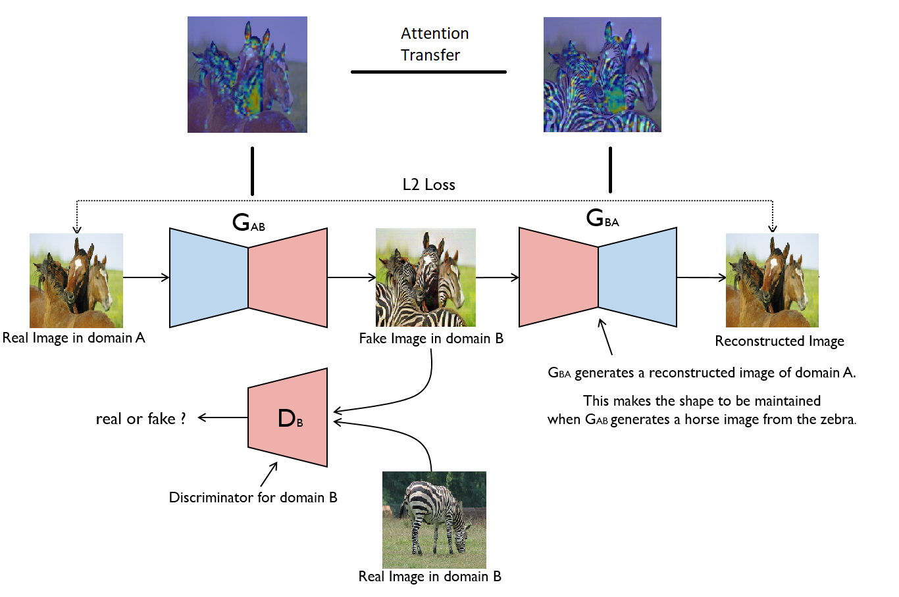
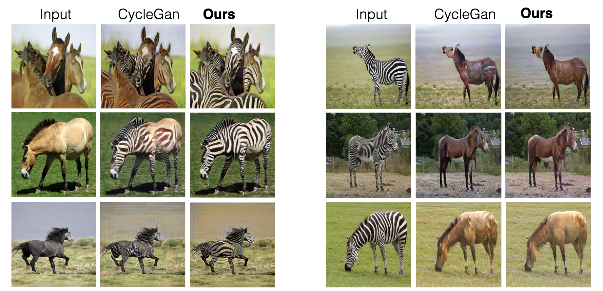
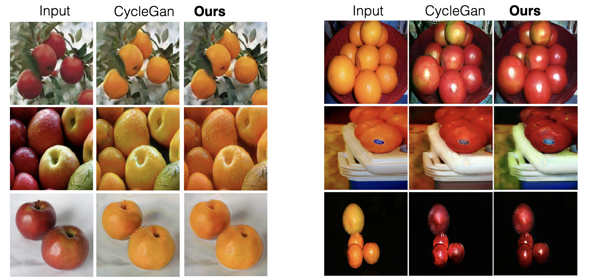

# Unsupervised Attention-guided Image-to-Image Translation

This repository contains the PyTorch code for our ICIAP 2021 paper [“Avoiding Shortcuts in Unpaired Image-to-Image
Translation”](https://link.springer.com/chapter/10.1007/978-3-031-06427-2_39). This code is based on the PyTorch implementation of CycleGAN provided by [Jun-Yan Zhu](https://github.com/junyanz/pytorch-CycleGAN-and-pix2pix).

By leveraging attention, our architecture (shown in the figure bellow) only maps relevant areas of the image, and by doing so, further enhances the quality of image to image translation.

Our model architecture is defined as depicted below, please refer to the paper for more details: 


## Mapping results

### Horse-to-Zebra image translation results: 



### Apple-to-Orange image translation results: 
Top row in the figure below are input images and bottom row are the mappings produced by our algorithm.



## Getting Started
### Installation

- Clone this repo:
```bash
git clone https://github.com/FilippoBotti/cyclegan-paper.git
```

- Install [PyTorch](http://pytorch.org) and 0.4+ and other dependencies.
  - For pip users, please type the command `pip install -r requirements.txt`.
  - For Conda users, you can create a new Conda environment using `conda env create -f environment.yml`.

### CycleGAN train/test
- Download a CycleGAN dataset (e.g. maps):
```bash
bash ./datasets/download_cyclegan_dataset.sh maps
```
- Train a model:
```
python train.py --dataroot ./datasets/maps --name maps_cyclegan --model cycle_gan
```
- Test the model:
```bash
#!./scripts/test_cyclegan.sh
python test.py --dataroot ./datasets/maps --name maps_cyclegan --model cycle_gan
```

### Apply a pre-trained model (CycleGAN)
- You can download a pretrained model (e.g. horse2zebra) with the following script:
```bash
bash ./scripts/download_cyclegan_model.sh horse2zebra
```
- The pretrained model is saved at `./checkpoints/{name}_pretrained/latest_net_G.pth`. Check [here](https://github.com/junyanz/pytorch-CycleGAN-and-pix2pix/blob/master/scripts/download_cyclegan_model.sh#L3) for all the available CycleGAN models.
- To test the model, you also need to download the  horse2zebra dataset:
```bash
bash ./datasets/download_cyclegan_dataset.sh horse2zebra
```

- Then generate the results using
```bash
python test.py --dataroot datasets/horse2zebra/testA --name horse2zebra --model test --no_dropout
```
- The option `--model test` is used for generating results of CycleGAN only for one side. This option will automatically set `--dataset_mode single`, which only loads the images from one set. On the contrary, using `--model cycle_gan` requires loading and generating results in both directions, which is sometimes unnecessary. The results will be saved at `./results/`. Use `--results_dir {directory_path_to_save_result}` to specify the results directory.


### Generate the results
```bash
python test.py --dataroot ./datasets/facades/ --direction BtoA --model pix2pix --name facades_label2photo_pretrained
```
- Note that we specified `--direction BtoA` as Facades dataset's A to B direction is photos to labels.

- If you would like to apply a pre-trained model to a collection of input images (rather than image pairs), please use `--model test` option. See `./scripts/test_single.sh` for how to apply a model to Facade label maps (stored in the directory `facades/testB`).


## Citation
If you use this code for your research, please cite our papers.
```
@InProceedings{10.1007/978-3-031-06427-2_39,
author="Fontanini, Tomaso
and Botti, Filippo
and Bertozzi, Massimo
and Prati, Andrea",
editor="Sclaroff, Stan
and Distante, Cosimo
and Leo, Marco
and Farinella, Giovanni M.
and Tombari, Federico",
title="Avoiding Shortcuts in Unpaired Image-to-Image Translation",
booktitle="Image Analysis and Processing -- ICIAP 2022",
year="2022",
publisher="Springer International Publishing",
address="Cham",
pages="463--475",
abstract="Image-to-image translation is a very popular task in deep learning. In particular, one of the most effective and popular approach to solve it, when a paired dataset of examples is not available, is to use a cycle consistency loss. This means forcing an inverse mapping in order to reverse the output of the network back to the source domain and reduce the space of all the possible mappings. Nevertheless, the network could learn to take shortcuts and softly apply the target domain in order to make the reverse translation easier therefore producing unsatisfactory results. For this reason, in this paper an additional constraint is introduced during the training phase of an unpaired image-to-image translation network; this forces the model to have the same attention both when applying the target domains and when reversing the translation. This approach has been tested on different datasets showing a consistent improvement over the generated results.",
isbn="978-3-031-06427-2"
}
```


## Related Projects
**[Jun-Yan Zhu](https://github.com/junyanz/pytorch-CycleGAN-and-pix2pix)**<br>


## Acknowledgments
Our code is inspired by [Jun-Yan Zhu](https://github.com/junyanz/pytorch-CycleGAN-and-pix2pix).